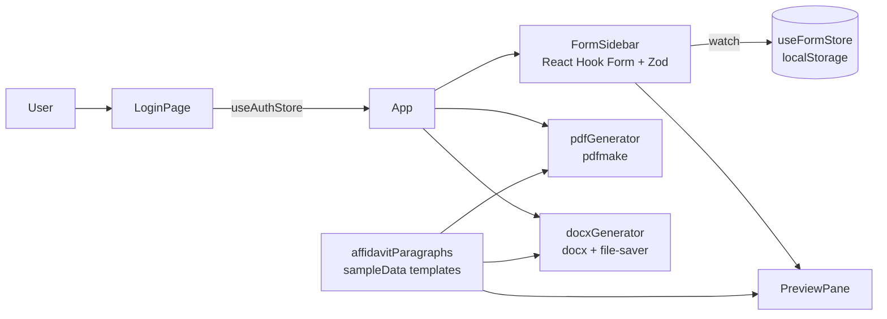

# LegalDocGen

A browser-based form-to-document tool that drafts Indian civil court filings (interlocutory applications and plaints) and exports them as PDF or DOCX.


Live demo: https://katta041.github.io/LegalDocGen/ (demo sign-in: `demo` / `demo`)

> **Not legal advice.** See the [Disclaimer](#disclaimer) before using any document this app produces.

## Overview

LegalDocGen replaces hand-editing of Word templates for routine civil court paperwork. A user fills in a structured form (court, parties, property schedule, title chain, counsel and so on) and the app assembles court-formatted text from fixed templates, shows a live A4-style preview, and exports the result.

The templates are modelled on civil court practice in Andhra Pradesh (the property fields use survey number, village, mandal and district). The bundled sample data is entirely fictional: invented parties, advocates, addresses in a made-up Sampurna District, and invented case, survey and document numbers. It contains no real personal data. Everything runs in the browser: there is no backend, database or AI model. Document text is produced by deterministic string templates in `src/lib`.

## Key features

- **Two document templates**, selectable from the header:
  - *Temporary Injunction (IA)*: application under Order XXXIX Rules 1 & 2 read with Section 151 CPC. Output includes the affidavit of the petitioner, the petition and prayer, the property schedule, address for service, verification and list of documents.
  - *Main Plaint (Suit)*: cause title, description of plaintiff and defendants, facts of the case, schedule of property, verification, list of documents and address for service.
- **Ten-section structured form** (court and case details, petitioner, respondents, property schedule, title chain, acquisition, impugned documents, cause of action, counsel, execution) with validation via Zod and React Hook Form. Labels switch between petitioner/respondent and plaintiff/defendant depending on the petition type.
- **Repeatable entries** for respondents, predecessors in title, vendors and advocates.
- **Auto-drafted affidavit paragraphs**: ownership, purchase, rectification deed, revenue mutation, title chain and cause of action paragraphs are built from whichever fields are filled in. A "Generate from Fields" button writes the facts text into an editable box.
- **Live preview** that scrolls to the section currently being edited.
- **Export** to `LegalDocument.pdf` (pdfmake, A4) and `LegalDocument.docx` (docx, Times New Roman), generated client-side.
- **Autosave** of the form to the browser's `localStorage`, plus "Load Sample" and "Reset" actions.
- **Fictional sample data** for both templates, so every section renders without entering anything.
- **Demo sign-in gate** with a single demo account (client-side only, see [Security](#security)).

## Architecture



All state lives in two Zustand stores persisted to `localStorage` (`legaldocgen-storage` for the form, `legaldocgen-auth` for the session). The PDF, DOCX and preview renderers all read the same `FormValues` object defined in `src/lib/schema.ts`.

## Tech stack

| Area | Tools |
| --- | --- |
| UI | React 19, TypeScript, Tailwind CSS 3, lucide-react icons |
| Forms and validation | React Hook Form, Zod, @hookform/resolvers |
| State | Zustand (with `persist` middleware) |
| Document output | pdfmake (PDF), docx and file-saver (DOCX) |
| Build and tooling | Vite 8, ESLint 10 with typescript-eslint |
| Hosting | GitHub Pages via `gh-pages` |

`pdf-parse`, `pdfjs-dist` and `puppeteer` are listed as dependencies but are only used by the ad-hoc scripts in the repository root, not by the app.

## Getting started

### Prerequisites

- Node.js 20.19 or later, as required by Vite 8 (verified with Node 26 and npm 11)
- npm

### Install

```bash
git clone https://github.com/Katta041/LegalDocGen.git
cd LegalDocGen
npm install
```

`npm install` also downloads a Chromium build for Puppeteer. The app does not need it; set `PUPPETEER_SKIP_DOWNLOAD=1` before installing to skip it.

Note: at the time of writing `package-lock.json` is out of sync with `package.json`, so `npm ci` fails. Use `npm install` until the lock file is regenerated.

### Configuration

No environment variables are required. The app has no backend and makes no API calls.

Optionally, copy `.env.example` to `.env` to change the demo account. Vite compiles these values into the public bundle, so they are a demo gate and must never be a real password:

| Variable | Default | Purpose |
| --- | --- | --- |
| `VITE_DEMO_USERNAME` | `demo` | Demo account user name (case-insensitive) |
| `VITE_DEMO_PASSWORD` | `demo` | Demo account password |

### Run

```bash
npm run dev
```

Vite serves the app under the `/LegalDocGen/` base path, so open http://localhost:5173/LegalDocGen/ and sign in with the demo account (`demo` / `demo` unless you changed it in `.env`).

### Available scripts

| Script | Purpose |
| --- | --- |
| `npm run dev` | Start the Vite dev server |
| `npm run build` | Type-check (`tsc -b`) and build to `dist/` |
| `npm run preview` | Serve the production build locally |
| `npm run lint` | Run ESLint (currently reports existing `no-explicit-any` and hook warnings) |
| `npm run deploy` | Build and publish `dist/` to the `gh-pages` branch |

## Usage

1. Sign in with the demo account.
2. Pick a template from the header drop-down ("Temporary Injunction (IA)" or "Main Plaint (Suit)"). Choosing a template loads its sample data.
3. Edit the ten form sections. The preview on the right updates as you type.
4. Optionally click **Generate from Fields** in section 8 to draft the facts of the case, then edit the text.
5. Click **Download PDF** or **Download DOCX**.
6. Use **Reset** to clear the form and the saved copy in `localStorage`.

## Project structure

```
src/
  App.tsx                  Layout, template switching, export buttons
  components/
    FormSidebar.tsx        Ten-section input form
    PreviewPane.tsx        Live document preview
    LoginPage.tsx          Sign-in screen
    TemplateSelector.tsx   Template drop-down
    ui/                    Button, Card, Input, Label, Textarea primitives
  lib/
    schema.ts              Zod schema and FormValues type
    affidavitParagraphs.ts Paragraph and facts builders
    pdfGenerator.ts        pdfmake document definitions (IA and plaint)
    docxGenerator.ts       docx document definitions (IA and plaint)
    sampleData.ts          The two templates and their fictional sample data
    utils.ts               Class name and address helpers
  store/
    useFormStore.ts        Form state, autosave, draft actions
    useAuthStore.ts        Demo sign-in gate (single account from VITE_DEMO_*)
test_*.js, test_node_pdf.cjs, generate_test.ts,
testGenerators.ts
                           Exploratory scripts used during development
```

## Testing

There is no automated test suite and no `test` script. The root-level scripts (`testGenerators.ts`, `generate_test.ts`, `test_download*.js` and others) were exploratory and are not currently runnable as-is: some import names that no longer exist, and the Puppeteer scripts expect a dev server at `http://localhost:5173/` without the `/LegalDocGen/` base path.

Verified on a clean checkout: `npm install` and `npm run build` succeed, the built page loads in a headless browser, and both templates' fictional sample data render through the PDF generator.

## Deployment

The app is a static site deployed to GitHub Pages from the `gh-pages` branch:

```bash
npm run deploy
```

`vite.config.ts` sets `base: '/LegalDocGen/'` and `package.json` sets `homepage` to match. Deploying from a fork requires changing both.

## Status and roadmap

**Status: working prototype.** The two templates render and export, but the app is not hardened for production use.

Known gaps and planned improvements:

- Replace the demo sign-in gate with real authentication (server-side or an identity provider) if the app ever handles real client data.
- Wire the existing draft save/load actions in `useFormStore` into the UI (they are implemented in the store but not exposed).
- Add automated tests for the paragraph builders and the PDF/DOCX generators, and a CI workflow for build and lint.
- Fix the existing lint errors and regenerate `package-lock.json`.
- Code-split the bundle (the production JavaScript chunk is about 2.6 MB before gzip).
- Move the root-level exploratory scripts out of the repository or into a `scripts/` folder.

## Security

- The app holds no API keys or secrets and needs no environment variables.
- **The sign-in screen is a demo gate, not a security control.** It accepts a single demo account (`demo` / `demo` by default, configurable with `VITE_DEMO_USERNAME` and `VITE_DEMO_PASSWORD`). The check runs in browser JavaScript and the values are compiled into the public bundle, so anyone can read them and bypass the check. Never set them to a real or reused password, and do not rely on the gate to protect data.
- The repository and the bundled sample data contain no real personal data. All names, addresses and case details are fictional.
- Form data, including personal details of parties, is stored unencrypted in the browser's `localStorage` on the device in use. Clear it with **Reset** on shared machines.
- No data is sent to any server by the app itself.

## Disclaimer

LegalDocGen produces draft legal text from fixed templates and the information you enter. **It does not provide legal advice**, and using it does not create a lawyer-client relationship.

- Generated documents are drafts. They may be incomplete, out of date or wrong for your court, jurisdiction or facts.
- The templates follow one style of Andhra Pradesh civil court practice and have not been reviewed for any other court or jurisdiction.
- Every document must be reviewed, corrected and approved by a qualified advocate before it is signed, sworn or filed.
- The author accepts no liability for any loss arising from use of the generated documents.

## Licence

No licence has been chosen yet; all rights reserved.

## Author

Rohith Katta, [github.com/Katta041](https://github.com/Katta041)
